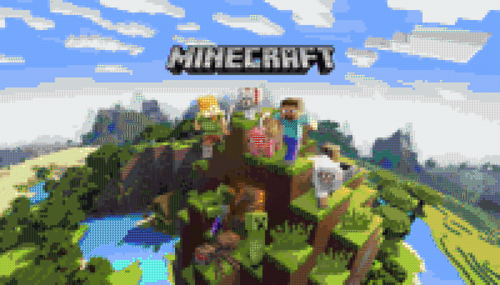
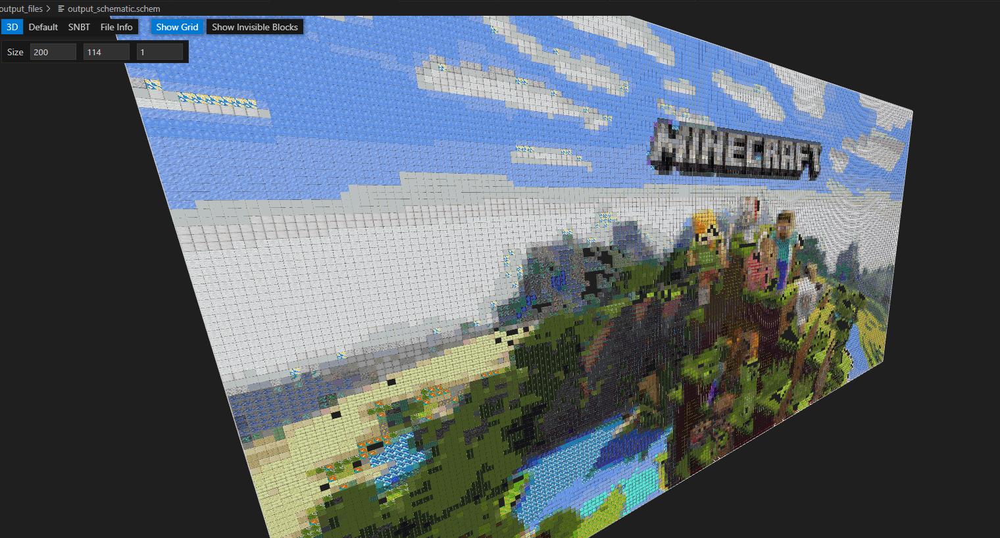
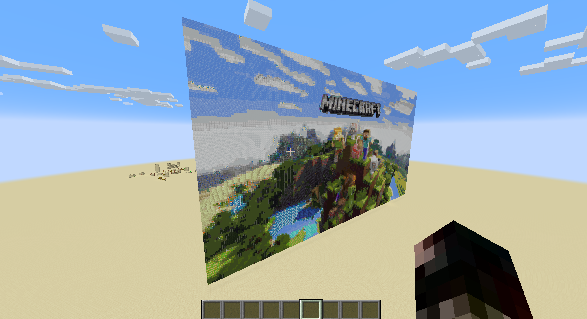

### **`README.md`**

# Minecraft Image to Block Converter

This tool allows you to convert images into Minecraft blocks. You can generate:
- **PNG outputs** showing the mapped Minecraft blocks,
- **Schematic (`.schem`) files** that can be loaded with WorldEdit, and
- **Setblock commands** to place blocks in your Minecraft world using WebSocket integration.

## **Table of Contents**
- [Installation](#installation)
- [Usage](#usage)
  - [Converting Images to PNG](#converting-images-to-png)
  - [Generating Schematic Files](#generating-schematic-files)
  - [Generating and Using Setblock Commands](#generating-and-using-setblock-commands)
- [Setting up Spigot Server with WebSocket Integration](#setting-up-spigot-server-with-websocket-integration)
  - [Installing Spigot and Plugins](#installing-spigot-and-plugins)
  - [Setting up Minecraft WebSocket Integration](#setting-up-minecraft-websocket-integration)
  - [Using Setblock Commands via WebSocket](#using-setblock-commands-via-websocket)

---

## **Installation**

1. **Clone the Repository:**
   ```bash
   git clone <repository-url>
   cd <repository-directory>
   ```

2. **Install Dependencies:**
   ```bash
   pip install -r requirements.txt
   ```

---

## **Usage**

### **Converting Images to PNG**

1. **Command to convert an image to PNG:**
   ```bash
   python main.py
   ```

2. **Follow the prompts:**
   - When prompted, choose the output format as `png`.
   - Enter the path to your image (e.g., `images/test.png`).
   - Specify the width (in blocks) to resize the image.
   
3. The resulting PNG will be saved in the `output_files` folder.

_Example:_

```plaintext
Please enter the output format (png, schem, setblock): png
Enter the path to the image file: images/starter_image.png
Enter the width (default is 16): 200
```

**PNG Result:**


---

### **Generating Schematic Files**

1. **Command to generate a schematic file:**
   ```bash
   python main.py
   ```

2. **Follow the prompts:**
   - Choose the output format as `schem`.
   - Enter the image path and specify the width.
   - Choose whether the structure should be vertical or horizontal.
   
3. The `.schem` file will be saved in the `output_files` folder.

_Example:_

```plaintext
Please enter the output format (png, schem, setblock): schem
Enter the path to the image file: images/starter_image.png
Enter the width (default is 16): 200
Should the structure be vertical or horizontal (vertical/horizontal)? horizontal
```

**Schematic Result:**


---

### **Generating and Using Setblock Commands**

1. **Command to generate setblock commands:**
   ```bash
   python main.py
   ```

2. **Follow the prompts:**
   - Choose the output format as `setblock`.
   - Enter the image path and specify the width.
   - Enter the starting coordinates for block placement (default is `0, 60, 0`).
   - Specify if the commands should be sent via WebSocket to your Minecraft server.
   (Be careful with this option as it will place blocks in your server, potentially overwriting existing structures.)

3. **Output:**
   - The setblock commands are saved in a JSON file (`setblock_commands.json`) in the `output_files` folder.
   - An undo file (`setblock_commands_undo.json`) is also generated to remove blocks using `/setblock ... minecraft:air`.

_Example:_

```plaintext
Please enter the output format (png, schem, setblock): setblock
Enter the path to the image file: images/starter_image.png
Enter the width (default is 16): 200
Enter the starting coordinates (x, y, z) separated by commas (default is 0, 60, 0): 0, 60, 10600
Do you want to send the commands via WebSocket (yes/no)? yes
```

**Setblock result:**


---

## **Setting up Spigot Server with WebSocket Integration**

To use the setblock commands in your Minecraft server, follow these steps to set up a **SpigotMC server** with WebSocket integration plugin.

### **Installing Spigot and Plugins**

1. **Download and Set Up Spigot:**
   - Download Spigot from [SpigotMC](https://www.spigotmc.org/).
   - Follow the [installation guide](https://www.spigotmc.org/wiki/spigot-installation/) to set up your server.

2. **Install Plugins:**
   - Install the following plugins:
     - [WorldEdit](https://enginehub.org/worldedit/) (optional for schematic files).
     - **Minecraft WebSocket Integration Plugin** (details in the next section).

### **Setting up Minecraft WebSocket Integration**

1. **Download and Install Minecraft WebSocket Integration Plugin:**
   - Download the WebSocket integration plugin from [GitHub](https://github.com/KK964/Minecraft_Websocket_Intergration).
   - Place the `.jar` file in the `plugins` folder of your Spigot server.
   
2. **Configure WebSocket:**
   - In the `plugins` folder, find the `Minecraft_Websocket_Integration/config.yml` file.
   - Enable the WebSocket and set the port (e.g., `8887`):
     ```yaml
        port: 8887
        debug: false
        log-failed-auth: false
     ```

3. **Restart your Minecraft Server:**
   ```bash
   java -Xmx1024M -Xms1024M -jar spigot.jar nogui
   ```

---

### **Using Setblock Commands via WebSocket**

1. **Ensure your server is running** with the WebSocket integration plugin enabled.
   
2. **Send Setblock Commands via WebSocket:**
   - After generating the setblock commands using this tool, ensure the WebSocket communication is enabled.
   - The commands will be sent to your server via WebSocket.

_Example:_

```plaintext
Command /setblock 0 60 10600 minecraft:stone
Command /setblock 1 60 10600 minecraft:dirt
```

- The blocks will appear at the specified coordinates in your Minecraft world.

---

## **License**

[MIT License](LICENSE)

---